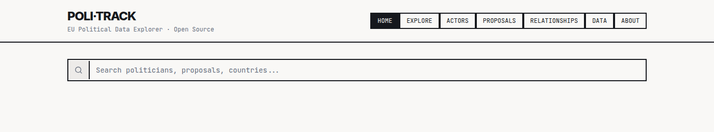
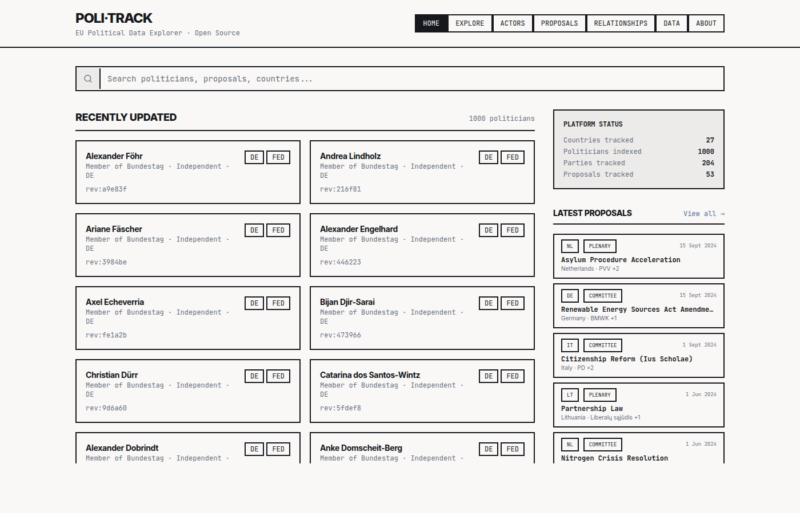
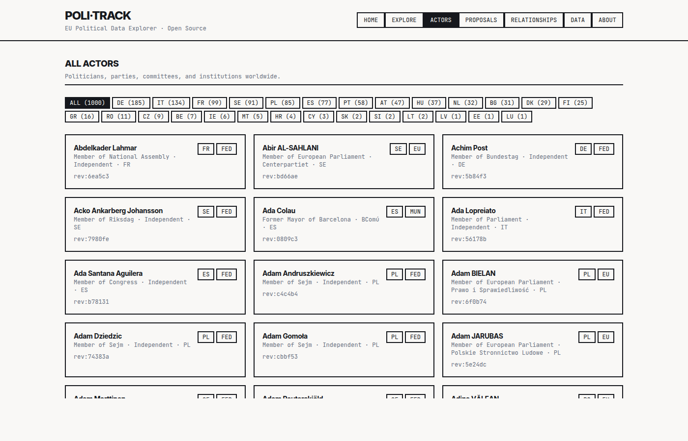
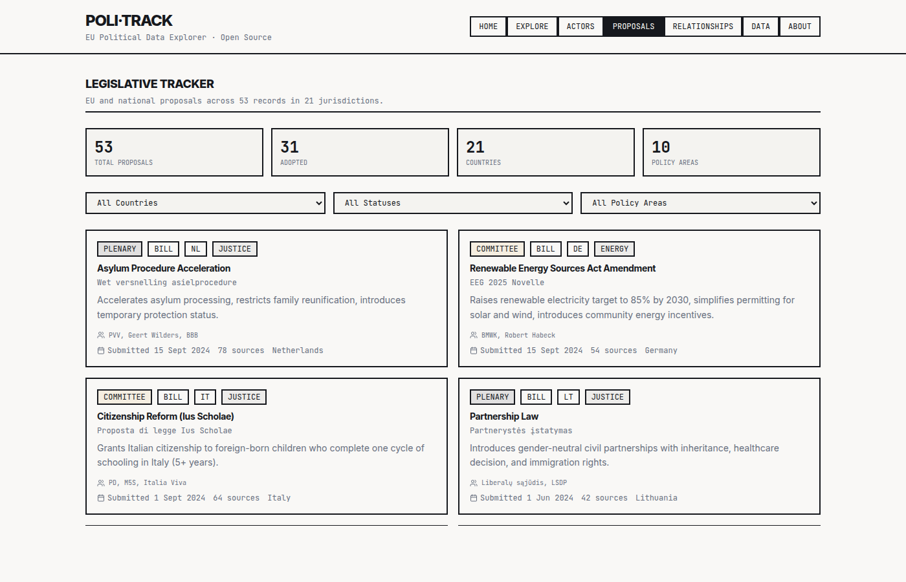

# Poli-Track

[](https://github.com/poli-track-os/poli-track-os/actions/workflows/ci.yml)
[](./LICENSE)

<p align="center">
  
</p>

**Poli-Track** is an open-source explorer for European political data — members of parliament, parties, proposals, finances, and the relationships between them. It pairs a React single-page frontend with a Supabase backend and a small ingestion stack that pulls from the European Parliament, official national parliament rosters, Wikipedia, the UN Digital Library, and EU institutional press feeds.

It is built for people who want to look up how a country voted on something, what a politician's public record actually says, or which proposals are moving through which parliament — without scrolling through press releases.

## Features

- Search across every tracked politician, party, proposal, and country.
- Politician profiles with Wikipedia-enriched biographies, committee memberships, finances, investments, and a git-log-style event timeline.
- Proposal tracking with status, policy area, jurisdiction, and affected laws.
- Country pages aggregating parliament composition, recent proposals, and stats.
- Relationship graphs showing party alliances and shared committee memberships.
- Comparative dashboards on the **Data** page — proposals by country, status, and policy area; politicians by country and party family.
- Political compass and policy-radar visualizations per politician.
- Public read-only API via Supabase Row-Level Security — no auth required to read.

## Screenshots

| | |
|---|---|
|  |  |
|  |  |
|  |  |

## Quick start

```bash
git clone https://github.com/poli-track-os/poli-track-os.git
cd poli-track
npm install
cp .env.example .env
npm run dev
```

Then open <http://localhost:5173>.

The app reads from Supabase and needs `VITE_SUPABASE_URL` and `VITE_SUPABASE_PUBLISHABLE_KEY` in `.env`. The defaults in `.env.example` point at the hosted Poli-Track project; swap them for your own Supabase project if you want an isolated backend.

## Tech stack

- **[React 18](https://react.dev/)** + **[Vite](https://vitejs.dev/)** + **[TypeScript](https://www.typescriptlang.org/)** — frontend.
- **[TanStack Query](https://tanstack.com/query)** — server-state cache for every fetch.
- **[Supabase](https://supabase.com/)** (Postgres + edge functions) — database, RLS, and ingestion runtime.
- **[Tailwind CSS](https://tailwindcss.com/)** + **[Radix UI](https://www.radix-ui.com/)** — styling and accessible primitives.
- **[Recharts](https://recharts.org/)** — charts on the Data and Relationships pages.
- **[React Router](https://reactrouter.com/)** — client-side routing.
- **[Vitest](https://vitest.dev/)** + **[Playwright](https://playwright.dev/)** — unit and E2E tests.

## Repository layout

```
poli-track/
├── src/
│   ├── App.tsx                     # Router + providers
│   ├── main.tsx                    # Entry point
│   ├── pages/                      # Route-level screens
│   │   ├── Index.tsx               # Home
│   │   ├── Explore.tsx             # Country coverage
│   │   ├── CountryDetail.tsx
│   │   ├── Actors.tsx
│   │   ├── ActorDetail.tsx
│   │   ├── Proposals.tsx
│   │   ├── ProposalDetail.tsx
│   │   ├── Relationships.tsx
│   │   ├── Data.tsx                # Comparative dashboards
│   │   └── About.tsx               # Methodology
│   ├── components/                 # Shared UI
│   │   ├── SiteHeader.tsx
│   │   ├── ActorCharts.tsx
│   │   ├── ActorTimeline.tsx
│   │   ├── PoliticalCompass.tsx
│   │   ├── PolicyRadar.tsx
│   │   ├── SearchBar.tsx
│   │   └── ...
│   ├── hooks/
│   │   ├── use-politicians.ts      # Politician/event/finance/position queries
│   │   └── use-proposals.ts        # Proposal queries and stats
│   ├── data/domain.ts              # Shared types and label maps
│   ├── integrations/supabase/
│   │   ├── client.ts               # Supabase client + env guard
│   │   └── types.ts                # Generated DB types
│   └── test/                       # Vitest smoke tests
│
├── supabase/
│   ├── migrations/                 # Postgres schema history
│   └── functions/                  # Deno edge ingesters
│       ├── scrape-eu-parliament/   # europarl.europa.eu MEP directory
│       ├── scrape-national-parliament/  # Wikipedia parliament categories
│       ├── enrich-wikipedia/       # Wikipedia bio + infobox harvest
│       ├── scrape-twitter/         # EU press release RSS
│       ├── scrape-un-votes/        # UN General Assembly voting records
│       ├── seed-positions/         # Party → political compass seeder
│       └── seed-associations/      # Party + committee relationship seeder
│
├── scripts/
│   ├── sync-official-rosters.ts    # Official national roster sync with field provenance
│   └── backfill-politician-positions.ts
│
├── docs/screenshots/               # Images used by README + wiki
├── .github/workflows/              # CI + ingestion scheduler
├── ARCHITECTURE.md                 # System overview
└── INGESTION.md                    # Data pipeline deep-dive
```

## Data pipeline

Every piece of politician, event, and proposal data visible in the UI comes from the edge functions under `supabase/functions/` plus the official-roster sync in [`scripts/sync-official-rosters.ts`](./scripts/sync-official-rosters.ts). The weekly [Ingest workflow](./.github/workflows/ingest.yml) runs the official national roster sync before Wikipedia enrichment and position seeding so party and role corrections propagate into downstream views.

See [INGESTION.md](./INGESTION.md) for an exhaustive breakdown of every source, transform, table, and consumer.

## Running locally

```bash
npm run dev         # Vite dev server with HMR
npm run build       # Production bundle into dist/
npm run preview     # Serve the built bundle
npm run test        # Unit tests (Vitest)
npm run lint        # ESLint
npm run typecheck   # tsc --noEmit
```

## Contributing

Contributions welcome. Start with [CONTRIBUTING.md](./CONTRIBUTING.md). The repository wiki has walkthroughs for each page of the app and deeper notes on the data model.

## License

[MIT](./LICENSE).
