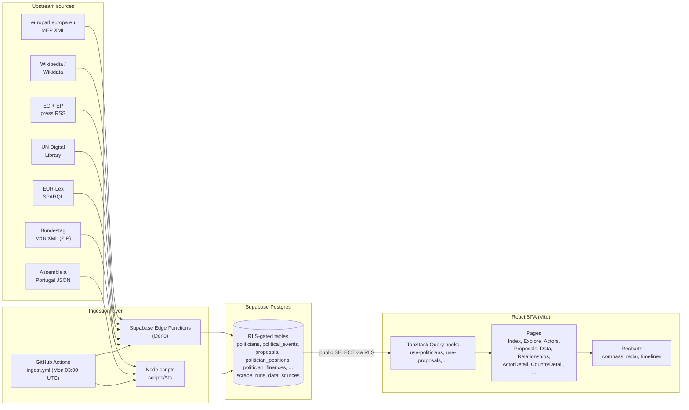
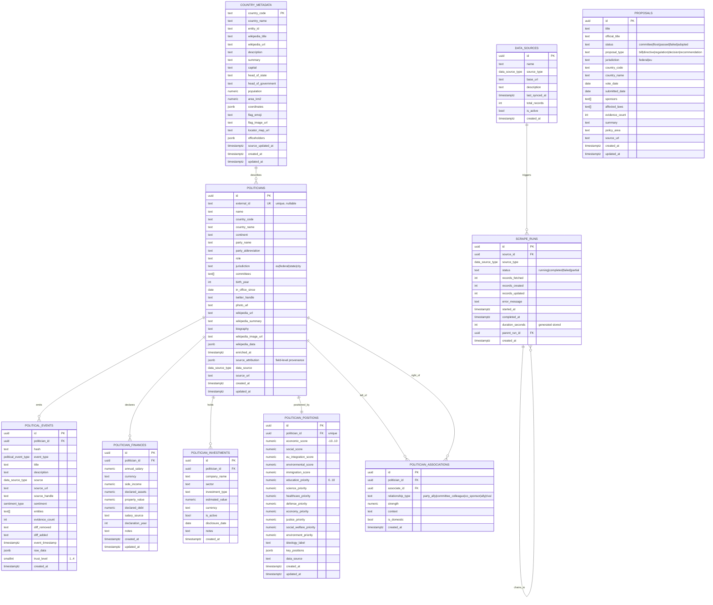
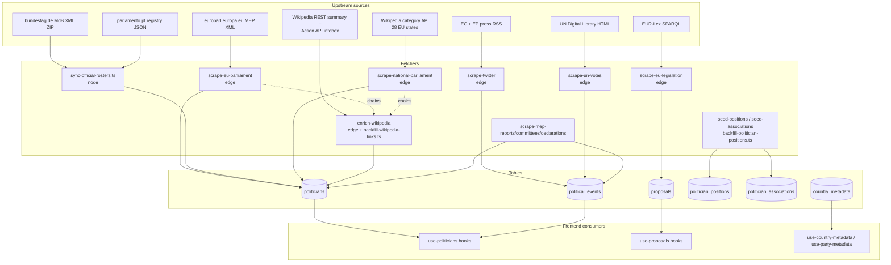

# Poli-Track — Repository Overview

> **Status:** pre-alpha · **Package:** `poli-track` · **License:** MIT
> **Runtime:** Node ≥ 22, npm ≥ 10 (frontend/scripts) · Deno (Supabase edge functions)
> **Stack:** React 18 + Vite + TypeScript · Supabase (Postgres + Edge Functions) · TanStack Query · Tailwind · Recharts

This document is an extensive, single-file map of the Poli-Track codebase: what it is, how the pieces connect, where data comes from, and how contributors ship changes. It is intended to be readable cold — you should not need prior context to find your way around.

For narrower deep dives see the in-repo siblings: [ARCHITECTURE.md](ARCHITECTURE.md), [INGESTION.md](INGESTION.md), [CONTRIBUTING.md](CONTRIBUTING.md), [GOVERNANCE.md](GOVERNANCE.md), and the [wiki/](wiki/) directory.

---

## Table of contents

1. [What Poli-Track is](#1-what-poli-track-is)
2. [High-level system diagram](#2-high-level-system-diagram)
3. [Repository tree](#3-repository-tree)
4. [Frontend (React SPA)](#4-frontend-react-spa)
5. [Backend (Supabase Postgres + Edge Functions)](#5-backend-supabase-postgres--edge-functions)
6. [Data model (ER diagram)](#6-data-model-er-diagram)
7. [Ingestion pipeline](#7-ingestion-pipeline)
8. [Scripts and local tooling](#8-scripts-and-local-tooling)
9. [Build, test, and quality gates](#9-build-test-and-quality-gates)
10. [CI / CD workflows](#10-ci--cd-workflows)
11. [Governance, community, and docs](#11-governance-community-and-docs)
12. [Known limits and gotchas](#12-known-limits-and-gotchas)
13. [Glossary](#13-glossary)

---

## 1. What Poli-Track is

Poli-Track is an open-source **explorer for European political data** — members of parliament, parties, proposals, finances, and the relationships between them. It pairs a React single-page frontend with a Supabase backend (Postgres + RLS + edge functions) and a small ingestion stack that pulls from:

- **European Parliament** MEP XML directory
- **Official national parliament** rosters (Germany Bundestag XML, Portugal Assembleia JSON, extensible)
- **National parliament** lists via Wikipedia category API (28 EU member states)
- **Wikipedia / Wikidata** for biographies, infoboxes, and party metadata
- **UN Digital Library** for General Assembly voting records
- **EU institutional press feeds** (European Commission press corner, EP news RSS)
- **EUR-Lex** (CELEX sector 3) for adopted EU secondary legislation

The product aim is simple: **look up how a country voted, what a politician's public record actually says, and which proposals are moving through which parliament — without scrolling through press releases.** Data is exposed publicly through Supabase Row-Level Security (read only, no auth required).

### Highlighted features

- Global search across politicians, parties, proposals, and countries.
- Politician profiles with Wikipedia-enriched biographies, committee memberships, finances, investments, a git-log-style event timeline, political compass, and policy radar.
- Proposal tracking with status, policy area, jurisdiction, and affected laws.
- Country pages aggregating leadership, parliament composition, recent proposals, and demographic stats.
- Relationship graphs showing party alliances and shared committee memberships.
- Comparative dashboards (proposals by country/status/area; politicians by country/party family; per-capita and per-GDP ratios).
- Dark/light theme with brutalist aesthetic (2 px borders, HSL CSS variables, Inter + JetBrains Mono).
- Public read-only API via Supabase RLS.

---

## 2. High-level system diagram



The architectural truth is intentionally narrow: the repo is a **web client + database schema history + a handful of Deno edge ingesters and Node maintenance scripts.** There is no app server of our own — the browser talks directly to Supabase using the anon/publishable key, and all writes flow through service-role edge functions.

---

## 3. Repository tree

```text
poli-track-os/
├── .github/
│   ├── workflows/
│   │   ├── ci.yml                 # lint → typecheck → test → build on PR/push
│   │   ├── dependency-review.yml  # PR supply-chain review
│   │   └── ingest.yml             # weekly data ingestion (Mon 03:00 UTC)
│   ├── ISSUE_TEMPLATE/            # bug / feature / docs forms + config.yml
│   ├── PULL_REQUEST_TEMPLATE.md
│   ├── CODEOWNERS
│   └── dependabot.yml
│
├── src/                           # React SPA
│   ├── main.tsx                   # React root
│   ├── App.tsx                    # QueryClientProvider + Router + theme
│   ├── index.css                  # HSL CSS variables (light + dark), brutalist utilities
│   ├── pages/                     # 12 route-level screens
│   ├── components/                # Cards, charts, layout, provenance UI
│   ├── hooks/                     # TanStack Query data hooks
│   ├── data/domain.ts             # Shared Actor/Event/Changelog types + label maps
│   ├── lib/                       # Pure helpers (positioning, coverage, party, dates, ...)
│   ├── integrations/supabase/
│   │   ├── client.ts              # Supabase JS client + env guard
│   │   └── types.ts               # Generated DB types (supabase gen types)
│   └── test/                      # Vitest suites (setup + 13 specs)
│
├── supabase/
│   ├── config.toml                # project_id
│   ├── migrations/                # 13 timestamped SQL migrations
│   └── functions/                 # Deno edge functions (12 directories)
│       ├── scrape-eu-parliament/
│       ├── scrape-national-parliament/
│       ├── scrape-eu-legislation/
│       ├── scrape-un-votes/
│       ├── scrape-twitter/
│       ├── scrape-mep-reports/
│       ├── scrape-mep-declarations/
│       ├── scrape-mep-committees/
│       ├── enrich-wikipedia/
│       ├── sync-country-metadata/
│       ├── seed-positions/
│       └── seed-associations/
│
├── scripts/
│   ├── sync-official-rosters.ts       # Bundestag + Assembleia sync w/ field provenance
│   ├── backfill-politician-positions.ts
│   ├── backfill-wikipedia-links.ts
│   └── deploy-supabase.sh             # supabase db push + functions deploy
│
├── wiki/                          # In-repo mirror of the GitHub wiki (16 files)
├── docs/screenshots/              # 8 PNGs used by README + wiki
├── dist/                          # Vite build output (gitignored)
├── .lovable/plan.md               # Original Lovable product brief
│
├── index.html                     # Vite entry, theme bootstrap, OG tags
├── vite.config.ts                 # React SWC, path alias @→src, port 8080
├── vitest.config.ts               # jsdom env, globals, src/test/setup.ts
├── tailwind.config.ts             # class dark mode, HSL tokens, accordion anims
├── postcss.config.js              # tailwindcss + autoprefixer
├── eslint.config.js               # flat config, react-hooks, react-refresh, ts-eslint
├── tsconfig.json / .app / .node   # layered TS project references
├── deno.lock                      # lockfile for Deno edge functions
├── package.json / package-lock.json
├── .env.example                   # VITE_SUPABASE_URL + _PUBLISHABLE_KEY template
├── .nvmrc                         # 22
├── .editorconfig                  # UTF-8, LF, 2 spaces
│
├── README.md
├── ARCHITECTURE.md                # System overview (short)
├── INGESTION.md                   # Pipeline deep-dive (~68 KB)
├── CHANGELOG.md
├── CONTRIBUTING.md
├── GOVERNANCE.md
├── CODE_OF_CONDUCT.md             # Contributor Covenant 2.1
├── SECURITY.md
├── SUPPORT.md
└── LICENSE                        # MIT
```

---

## 4. Frontend (React SPA)

### 4.1 Entry and app shell

- [src/main.tsx](src/main.tsx) — mounts `<App />` with React 18's `createRoot`.
- [src/App.tsx](src/App.tsx) — wraps the tree in `QueryClientProvider` (a single shared `QueryClient`), a `ThemeModeProvider`, and a `BrowserRouter`. Pages are lazy-loaded inside a `Suspense` fallback. Theme state (light/dark) is owned here and toggles a `dark` class on `document.documentElement`; a small bootstrap script in [index.html](index.html) applies the persisted or system-preferred theme before the bundle loads, preventing a flash.

There is **no** bundled toast/tooltip/UI-kit scaffold in the live app path — layout is done per-page using `SiteHeader` + `SiteFooter`.

### 4.2 Routing table

| Route | Component | Primary hooks | Purpose |
|---|---|---|---|
| `/` | [Index.tsx](src/pages/Index.tsx) | `usePoliticians`, `useCountryStats`, `useProposals` | Landing dashboard: search, recent actors, platform stats, latest proposals, countries by coverage |
| `/explore` | [Explore.tsx](src/pages/Explore.tsx) | `useCountryStats`, `usePoliticians` | Continent → country → actor discovery grid |
| `/country/:id` | [CountryDetail.tsx](src/pages/CountryDetail.tsx) | `useCountryStats`, `usePoliticiansByCountry`, `useCountryMetadata`, `usePartiesMetadata`, `useProposalsByCountry` | Country dossier: leadership, politicians grouped by party, proposals |
| `/country/:countryId/party/:partyId` | [PartyDetail.tsx](src/pages/PartyDetail.tsx) | `usePoliticiansByCountry`, `usePartyMetadata`, `useProposalsByCountry` | Country-scoped party roster, leaders, committees, proposals |
| `/actors` | [Actors.tsx](src/pages/Actors.tsx) | `usePoliticians` | Filterable politician directory (query + country) |
| `/actors/:id` | [ActorDetail.tsx](src/pages/ActorDetail.tsx) | `usePolitician`, `usePoliticianEvents`, `usePoliticianFinances`, `usePoliticianInvestments`, `usePoliticianPosition`, `useAllPositions`, `usePoliticianAssociates`, `useCountryMetadata`, `usePartyMetadata`, `useWikipediaPageSummary`, `useProposalsByCountry` | The richest page: biography, timeline, compass, radar, finances, investments, associates |
| `/proposals` | [Proposals.tsx](src/pages/Proposals.tsx) | `useProposals(filters)`, `useProposalStats` | Filterable list with URL-backed `?country=&status=&area=` filters |
| `/proposals/:id` | [ProposalDetail.tsx](src/pages/ProposalDetail.tsx) | `useProposal` | Proposal dossier: summary, affected laws, source |
| `/relationships` | [Relationships.tsx](src/pages/Relationships.tsx) | `useAllPositions`, `usePoliticians`, `useCountryStats` | Three view tabs: clusters by ideology, connections, tree |
| `/data` | [Data.tsx](src/pages/Data.tsx) | live supabase coverage query + hooks | Comparative dashboards, coverage explorer, scatter/heatmap/radar |
| `/about` | [About.tsx](src/pages/About.tsx) | — | Product & methodology copy |
| `*` | NotFound | — | 404 |

### 4.3 Hooks (server-state)

All live under [src/hooks/](src/hooks/). TanStack Query is the single source of truth for server state — pages compose hooks directly; there is no additional service layer.

**[use-politicians.ts](src/hooks/use-politicians.ts)**
- `usePoliticians()` — all politicians, sorted by name. Key: `['politicians']`.
- `usePolitician(id)` — single politician. Key: `['politician', id]`.
- `usePoliticianFinances(id)` — latest year by `declaration_year` desc.
- `usePoliticianInvestments(id)` — sorted by `estimated_value` desc.
- `usePoliticianEvents(id)` — timeline, mapped to the `ActorEvent` contract.
- `usePoliticianPosition(id)` — `politician_positions` row, resolved through `resolvePoliticalPosition()`.
- `useAllPositions()` — every position joined with name/party/country.
- `usePoliticianAssociates(id)` — bidirectional associations, top 20 by strength.
- `usePoliticiansByCountry(code)` — per-country list.
- `useCountryStats()` — in-app aggregate (count + party set per country).

**[use-proposals.ts](src/hooks/use-proposals.ts)**
- `useProposals(filters?)`, `useProposal(id)`, `useProposalsByCountry(code)`, `useProposalsByPolicyAreas(areas)`, `useProposalStats()`. Also exports `statusLabels` and `statusColors`.

**[use-country-metadata.ts](src/hooks/use-country-metadata.ts)**
- `useCountryMetadata(code, name)` — reads `country_metadata`, falls back to a live Wikidata/Wikipedia fetch via `loadCountryMetadata()` from [src/lib/country-metadata-live.ts](src/lib/country-metadata-live.ts). 24 h stale/gc time.

**[use-party-metadata.ts](src/hooks/use-party-metadata.ts)**
- `usePartyMetadata(party, country)` — Wikidata search + entity extraction, with an exclusion list for generic labels (independent, unaligned, ...).

**[use-theme-mode.ts](src/hooks/use-theme-mode.ts)**
- `{ theme, isDark, setTheme, toggleTheme }` — persists to `localStorage['poli-track-theme']`, applies the root `dark` class, and keeps the `<meta name="theme-color">` in sync.

**[use-wikipedia-page.ts](src/hooks/use-wikipedia-page.ts)**
- `useWikipediaPageSummary()` — on-demand Wikipedia REST summary lookup.

### 4.4 Components (grouped)

Under [src/components/](src/components/):

| Group | Key files | Notes |
|---|---|---|
| Layout | `SiteHeader`, `SiteFooter`, `ThemeModeProvider`, `ThemeToggle` | Nav, mobile hamburger, active-route highlighting, theme button |
| Cards | `ActorCard`, `ProposalCard`, `CountryShapeCard`, `CountryMiniGlobe`, `OfficeholderCard` | Compact, linkable summaries |
| Charts | `ActorCharts`, `PoliticalCompass`, `PolicyRadar`, `ActorTimeline` | Recharts-based; compass plots economic × social, radar plots 8 priorities |
| Data explorer | `DataCoverageExplorer`, `SearchBar` | Coverage tabs (people / parties / countries), global search |
| Provenance | `SourceBadge`, `ProvenanceBar`, `ChangeLogItem`, `LinkedPersonTextList` | Trust-level badges (official / fact / estimate / model), changelog rendering |

### 4.5 Shared contracts and libs

- [src/data/domain.ts](src/data/domain.ts) — the app's own `Actor`, `ActorEvent`, `ChangeLogEntry` types and label maps. Intentionally decoupled from the generated Supabase types so that mapping is explicit.
- [src/lib/political-positioning.ts](src/lib/political-positioning.ts) — ~20 EU party profiles, 9 ideology families, HSL color map, scoring helpers, and `resolvePoliticalPosition()` fallback chain.
- [src/lib/country-metadata-live.ts](src/lib/country-metadata-live.ts) — async Wikidata/Wikipedia loader used as the fallback for `useCountryMetadata`.
- [src/lib/country-leadership.ts](src/lib/country-leadership.ts) — merges tracked officeholders with Wikidata leadership.
- [src/lib/data-coverage.ts](src/lib/data-coverage.ts) — coverage ledger used by the Data page.
- [src/lib/party-summary.ts](src/lib/party-summary.ts) — `slugifyPartyName`, `buildPartyDescription`, `getTopCommittees`.
- [src/lib/official-rosters.ts](src/lib/official-rosters.ts) — parsers for official government roster formats (used by both scripts and tests).
- [src/lib/person-display.ts](src/lib/person-display.ts), [src/lib/date-display.ts](src/lib/date-display.ts), [src/lib/data-availability-heatmap.ts](src/lib/data-availability-heatmap.ts) — small display helpers.

### 4.6 Supabase client

- [src/integrations/supabase/client.ts](src/integrations/supabase/client.ts) — singleton built from `VITE_SUPABASE_URL` and `VITE_SUPABASE_PUBLISHABLE_KEY`, with auth persistence + token refresh enabled.
- [src/integrations/supabase/types.ts](src/integrations/supabase/types.ts) — fully generated `Database` type; the source of truth for table Row/Insert/Update shapes and enum unions. Regenerated via `supabase gen types`.

### 4.7 Styling

- [tailwind.config.ts](tailwind.config.ts) — class-based dark mode, HSL CSS-variable tokens for primary/secondary/accent/muted/destructive/success/warning/sidebar, `tailwindcss-animate` plugin, custom accordion keyframes, brutalist-friendly `borderRadius: 0`.
- [src/index.css](src/index.css) — two palettes of HSL variables (`:root` + `.dark`), utility classes like `.brutalist-border`, `.evidence-tag`, `.diff-added/removed`, and mobile-specific Recharts sizing.
- [index.html](index.html) — theme bootstrap script reads `localStorage['poli-track-theme']` (falling back to `prefers-color-scheme`) before the bundle paints.

---

## 5. Backend (Supabase Postgres + Edge Functions)

### 5.1 Migrations in order

Every file under [supabase/migrations/](supabase/migrations/) is timestamped and SQL-only. Running `supabase db push` applies them in order. The ordering tells the evolution story: core → enrichment → finances → positions → associations → proposals → idempotency/trust hardening → country metadata cache → field-level provenance.

| # | File | Summary |
|---|---|---|
| 1 | `20260410090851_initial_schema.sql` | Enums (`political_event_type` × 21, `data_source_type` × 9, `sentiment_type`), tables `politicians`, `political_events`, `data_sources`, `scrape_runs`; `update_updated_at_column()` trigger fn; RLS public SELECT everywhere |
| 2 | `20260410094556_wikipedia_columns.sql` | Adds Wikipedia enrichment columns on `politicians` |
| 3 | `20260410101746_politician_finances.sql` | `politician_finances` (unique per year) + `politician_investments` |
| 4 | `20260410103008_politician_positions.sql` | 24-column compass & priority table; unique per politician |
| 5 | `20260410103524_politician_associations.sql` | Relationship graph (party_ally, committee_colleague, co_sponsor, ally, rival) |
| 6 | `20260410103922_proposals.sql` | Proposals table with status/type/jurisdiction/policy_area |
| 7 | `20260412170000_ingestion_truth.sql` | Adds `wikipedia` to the `data_source_type` enum; refreshes seeded source rows |
| 8 | `20260412170100_ingestion_truth_seeds.sql` | Seeds new rows for Wikipedia and national-parliament Wikipedia categories |
| 9 | `20260412180000_ingest_hardening.sql` | Dedup partial unique index on `political_events(politician_id, source_url, event_timestamp)`; `trust_level` column; generated `duration_seconds`; `parent_run_id` self-FK; `increment_total_records()` RPC; drops unused `city`/`net_worth`/`top_donors` on `politicians` |
| 10 | `20260412190000_politicians_external_id_unique.sql` | Partial unique on `politicians.external_id WHERE NOT NULL` |
| 11 | `20260412200000_politicians_external_id_plain_unique.sql` | Replaces with plain unique (Supabase JS `upsert` emits bare `ON CONFLICT` with no WHERE) |
| 12 | `20260413120000_country_metadata_cache.sql` | `country_metadata` (PK `country_code`) with flags, capital, leaders, demographics, officeholders JSONB |
| 13 | `20260413183000_politician_source_attribution.sql` | Adds `source_attribution JSONB NOT NULL DEFAULT '{}'` for field-level provenance |

### 5.2 RLS model

Every table has RLS enabled with a single policy: `FOR SELECT USING (true)`. Writes are service-role only — the frontend uses the publishable (anon) key and reads only; ingesters authenticate with `SUPABASE_SERVICE_ROLE_KEY` and bypass RLS. This is deliberate: Poli-Track is a transparency project, so every field shown in the UI is also publicly queryable.

### 5.3 RPC and trigger functions

- **`update_updated_at_column()`** — `BEFORE UPDATE` trigger that sets `NEW.updated_at = now()`. Attached to `politicians`, `politician_finances`, `politician_positions`, `proposals`, `country_metadata`.
- **`increment_total_records(p_source_type data_source_type, p_delta integer)`** — `SECURITY DEFINER`, `GRANT EXECUTE TO service_role`. Bumps `data_sources.total_records` additively and stamps `last_synced_at = now()`. Called by every ingestion function after a successful batch.

No materialized views or stored procedures beyond that — orchestration lives in edge functions.

### 5.4 Edge functions

Twelve Deno functions under [supabase/functions/](supabase/functions/). All writes go through the service-role client; all responses are JSON and CORS-enabled.

| Function | Trigger | Upstream | Writes to | Key behavior |
|---|---|---|---|---|
| **scrape-eu-parliament** | ingest.yml, manual | europarl.europa.eu full MEP XML | `politicians` (upsert by `external_id`), `scrape_runs`, `data_sources` counter | `fast-xml-parser`, 150-row chunked upsert, chains enrich-wikipedia for the top 20 newly-created rows with `parent_run_id` linkage |
| **scrape-national-parliament** | ingest.yml, manual | Wikipedia categorymembers API (28 EU states) | `politicians`, `scrape_runs` | Filters out "List of", disambig, categories; chains enrich-wikipedia |
| **scrape-eu-legislation** | ingest.yml, manual | EUR-Lex SPARQL (CELEX sector 3) | `proposals` | SPARQL filter to L/R/D/H CELEX types; keyword-based policy_area detection; dedupes on `source_url` |
| **scrape-un-votes** | ingest.yml, manual | digitallibrary.un.org HTML | `political_events (event_type='vote')`, `scrape_runs`, `data_sources` | Parses Y/N/A country vote lists, attributes country-level vote to every politician from that country (clearly marked), trust_level=1, 500 ms rate-limit |
| **scrape-twitter** (misnomer — it is press RSS) | ingest.yml, manual | EC press corner + EP news RSS | `political_events (public_statement)` | Regex RSS item parse; strict ASCII-normalized whole-word name match; extracts hashtags/mentions as entities; trust_level=3; no sentiment |
| **scrape-mep-reports** | ingest.yml | EP per-MEP `/main-activities/reports` | `political_events (legislation_sponsored)`, `scrape_runs` | A-number + committee + date extraction; 90 s wall-clock, 150 ms rate-limit; partial-unique dedup |
| **scrape-mep-committees** | ingest.yml | EP per-MEP home page | `politicians.committees[]`, `political_events (committee_join)` | Title/abbr regex |
| **scrape-mep-declarations** | ingest.yml | EP per-MEP `/declarations` page | (declaration metadata) | Catalogs declaration PDFs (roadmap P1.2/P1.3) |
| **enrich-wikipedia** | chained + ingest.yml | Wikipedia Action API + REST summary + Wikidata | `politicians.*` enrichment columns, `scrape_runs`, `data_sources` | ~5 req/s throttle with Retry-After, disambiguation guardrail (shared name token ≥ 4 chars + politician categories + country tie), infobox parsing (birth_date, party, term_start, committees, twitter, ...); 90 s wall-clock |
| **sync-country-metadata** | ingest.yml | Wikidata/Wikipedia via `loadCountryMetadata()` | `country_metadata`, `scrape_runs` | Discovers unique countries from `politicians` and refreshes any older than `staleAfterHours` (default 144 h) |
| **seed-positions** | ingest.yml, manual | Internal: party profile mapping via `buildEstimatedPoliticalPosition()` | `politician_positions` | Inserts "Unclassified" for unknown parties to avoid repeated lookups |
| **seed-associations** | ingest.yml, manual | Internal: `politicians.party_*`, `committees[]` | `politician_associations` | Pairs within each party (strength 6) and each committee bucket (strength 7), capped per politician, lexicographic key for stable unique pair, 90 s wall-clock |

### 5.5 Invocation patterns

- **Manual** — `curl -X POST "$SUPABASE_URL/functions/v1/<name>" -H "Authorization: Bearer $SERVICE_ROLE" -H "Content-Type: application/json" -d '{...}'`
- **Chained** — `scrape-eu-parliament` and `scrape-national-parliament` fire-and-forget the enrichment function for newly-created politician IDs; `parent_run_id` links the resulting `scrape_runs` row to the parent run.
- **Scheduled** — [.github/workflows/ingest.yml](.github/workflows/ingest.yml) cron runs every Monday 03:00 UTC and orchestrates the full sequence.

---

## 6. Data model (ER diagram)



### 6.1 Trust levels

| Level | Meaning | Used for |
|---|---|---|
| 1 | Official primary | EP roster, national roster, UN votes, EUR-Lex, rapporteur reports |
| 2 | Authoritative secondary | Press/news, financial filings, lobby registers |
| 3 | Derived / heuristic | Wikipedia enrichment, press-RSS matches |
| 4 | Low-confidence / inferred | (reserved) |

---

## 7. Ingestion pipeline

[INGESTION.md](INGESTION.md) is the long-form reference (~68 KB). What follows is the operational shape.

### 7.1 Sources → fetchers → tables → consumers



### 7.2 Provenance and idempotency

- **Field-level provenance** lives in `politicians.source_attribution` (JSONB). Keys are field names; values carry source label, URL, record id, and fetch timestamp. Written today by the Node scripts (`sync-official-rosters.ts`, `backfill-wikipedia-links.ts`); edge functions do not yet populate it.
- **Dedup for events** — partial unique index on `political_events(politician_id, source_url, event_timestamp) WHERE source_url IS NOT NULL`. Reruns of `scrape-eu-legislation`, `scrape-mep-reports`, and `scrape-twitter` are therefore safe.
- **Dedup for politicians** — plain `UNIQUE(external_id)`; multiple NULLs are allowed (Postgres does not count NULLs as equal) so national-parliament rows without a Wikidata QID can coexist.
- **Run audit** — `scrape_runs` captures status + fetched/created/updated counts + `duration_seconds` (generated column) + `parent_run_id` for chained invocations.
- **Source counter** — `increment_total_records()` RPC keeps `data_sources.last_synced_at` and cumulative totals consistent.

### 7.3 Known ingestion risks (see INGESTION.md §9)

- Press-RSS matching can false-positive on short surnames (substring collisions).
- UN votes are attributed to **every** politician from the voting country; the UI labels this as country-level attribution.
- `scrape-national-parliament` inserts without `ON CONFLICT` so same-name collisions across countries can duplicate until enriched with `external_id`.
- `enrich-wikipedia` may unconditionally overwrite an EP-hosted MEP portrait with the Wikipedia image.
- Sentiment analysis has been removed — `scrape-twitter` sets `sentiment = NULL`.

---

## 8. Scripts and local tooling

All scripts run with Node 22's `--experimental-strip-types` so TypeScript is executed directly, no separate build step.

| Script | Purpose | Reads | Writes | Flags |
|---|---|---|---|---|
| [scripts/sync-official-rosters.ts](scripts/sync-official-rosters.ts) | Fetch Bundestag + Assembleia rosters, match by `external_id`/provenance/name, upsert with field-level attribution | bundestag.de ZIP (requires `unzip`), parlamento.pt JSON, existing `politicians`/`politician_positions` | `politicians`, `source_attribution`, `scrape_runs` | `--apply`, `--countries PT,DE`, `--expect-project-ref` |
| [scripts/backfill-wikipedia-links.ts](scripts/backfill-wikipedia-links.ts) | Hydrate Wikipedia summary/biography/image for politicians with a URL but no enrichment | Wikipedia REST summary | enrichment columns on `politicians`, `source_attribution`, `scrape_runs` | `--apply`, `--batch-size`, `--concurrency` (default 6, max 20), `--limit` |
| [scripts/backfill-politician-positions.ts](scripts/backfill-politician-positions.ts) | Dry-run or apply party → position mapping | `politicians`, `politician_positions`, `buildEstimatedPoliticalPosition()` | `politician_positions` | `--apply`, `--batch-size`, `--limit`, `--overwrite-all` |
| [scripts/deploy-supabase.sh](scripts/deploy-supabase.sh) | Push migrations and deploy all edge functions | `supabase/migrations/*`, `supabase/functions/*` | Remote Supabase project | — |

Required env (all scripts): `SUPABASE_URL` (or `VITE_SUPABASE_URL`), `SUPABASE_SERVICE_ROLE_KEY` (required for `--apply`), `VITE_SUPABASE_PUBLISHABLE_KEY` (fallback for dry-runs).

---

## 9. Build, test, and quality gates

### 9.1 Toolchain

| Tool | Config | Purpose |
|---|---|---|
| Vite 5 (React SWC) | [vite.config.ts](vite.config.ts) | Dev server on IPv6 `::`:8080, HMR, `@→src` alias, dedupes react/react-dom/TanStack Query, dev-only `componentTagger()` from `lovable-tagger` |
| TypeScript 5 | [tsconfig.json](tsconfig.json), [tsconfig.app.json](tsconfig.app.json), [tsconfig.node.json](tsconfig.node.json) | Project references; app = ES2020, `bundler` resolution, react-jsx; node = ES2022 with `strict: true` for config itself |
| ESLint 9 (flat config) | [eslint.config.js](eslint.config.js) | TS recommended + `react-hooks` + `react-refresh`; `no-explicit-any: warn`; ignores `dist/` |
| Vitest 3 | [vitest.config.ts](vitest.config.ts) | `jsdom` env, globals, `src/test/setup.ts` patches `matchMedia`/`ResizeObserver` and imports `@testing-library/jest-dom` |
| Tailwind 3 | [tailwind.config.ts](tailwind.config.ts) | Class-based dark mode, HSL tokens, `tailwindcss-animate` |
| PostCSS | [postcss.config.js](postcss.config.js) | `tailwindcss` + `autoprefixer` |

### 9.2 npm scripts

```json
"dev":       "vite",                         // dev server, port 8080
"build":     "vite build",                   // production bundle → dist/
"build:dev": "vite build --mode development",
"preview":   "vite preview",
"lint":      "eslint .",
"typecheck": "tsc -b",                       // project-references build
"test":      "vitest run",
"test:watch":"vitest",
"check":     "npm run lint && npm run typecheck && npm test && npm run build"
```

`npm run check` is the canonical local pre-PR gate; CI runs the same four steps independently.

### 9.3 Test suites

Under [src/test/](src/test/), all specs run via Vitest + Testing Library.

| Spec | Target |
|---|---|
| `app.test.tsx` | App shell, nav, night-mode toggle, theme persistence |
| `actor-detail.test.tsx` | ActorDetail: ideology taxonomy, Wikipedia fallbacks, dossier rendering |
| `actors.test.tsx` | Actors page filters (query, party, committee) |
| `country-detail.test.tsx` | CountryDetail grouping and restoration logic |
| `country-shape-card.test.tsx` | Hover expansion behavior |
| `data-availability-heatmap.test.ts` | Heatmap cell styling across palettes |
| `data-coverage.test.tsx` | DataCoverageExplorer people/parties/countries tabs |
| `official-rosters.test.ts` | Bundestag XML + Portugal registry parsers |
| `party-detail.test.tsx` | PartyDetail rendering |
| `person-display.test.ts` | Wikipedia/Wikidata display helpers |
| `political-positioning.test.ts` | Ideology resolution, centrist separation, populist estimation |
| `proposals.test.tsx` | URL-backed filter hydration |
| `use-country-metadata.test.tsx` | Live-fetch fallback when cache errors |

### 9.4 Deno side

`deno.lock` at the root is for the edge functions, not the frontend. It pins `@supabase/supabase-js` and `fast-xml-parser` plus npm-scheme deps used inside the Deno runtime. Each edge function directory is a standalone `index.ts` entry; `scripts/deploy-supabase.sh` deploys them all.

---

## 10. CI / CD workflows

Three GitHub Actions workflows, all under [.github/workflows/](.github/workflows/).

### 10.1 `ci.yml` — pull request gate

```mermaid
flowchart LR
    A[PR or push to main] --> B[checkout]
    B --> C[setup-node@v4 from .nvmrc]
    C --> D[npm ci]
    D --> E[npm run lint]
    E --> F[npm run typecheck]
    F --> G[npm run test]
    G --> H[npm run build]
```

Concurrency groups cancel stale runs on the same ref.

### 10.2 `dependency-review.yml` — supply-chain

Runs on PRs only and uses `actions/dependency-review-action@v4` to flag newly-introduced dependencies with vulnerabilities or incompatible licenses.

### 10.3 `ingest.yml` — scheduled ingestion

- **Triggers:** cron `0 3 * * 1` (Mon 03:00 UTC) + `workflow_dispatch` with a `target` choice input and optional `country_code`.
- **Targets:** `all | country-metadata | eu-parliament | official-rosters | national-parliament | wikipedia | press-rss | un-votes | eu-legislation | mep-committees | mep-reports | mep-declarations | seed-positions | seed-associations`.
- **Secrets:** `SUPABASE_URL`, `SUPABASE_SERVICE_ROLE_KEY`.
- **Job shape (target = all):** sequential `curl --fail-with-body` against the relevant edge functions, with the Node roster sync invoked via `node scripts/sync-official-rosters.ts --apply --countries PT,DE`. Wikipedia backfill is run in a 20× loop of `enrich-wikipedia(batchSize=50)`.
- **Ordering:** scrape-eu-parliament → official rosters → national parliament → wikipedia backfill → country metadata → press RSS → UN votes → EUR-Lex → MEP committees/reports/declarations → seed-positions → seed-associations.

Concurrency: single ingestion run per ref; no parallelism (avoids stomping on partial `scrape_runs` state).

---

## 11. Governance, community, and docs

### 11.1 Governance stack

| File | What it says |
|---|---|
| [GOVERNANCE.md](GOVERNANCE.md) | Maintainer: `@poli-track-os`. Decision model: maintainers own direction, review, release, moderation; significant changes discussed in issues first. Planned branch protection: require PR + 1 approval + code-owner sign-off, dismiss stale approvals, block force pushes, linear history. |
| [CONTRIBUTING.md](CONTRIBUTING.md) | Read README + CoC first; open an issue for larger changes; dev loop is `npm install && npm run dev`; pre-PR checks are lint/typecheck/test/build; no direct pushes to `main`; focused, reversible changes; one approval + code owner review for protected files. |
| [CODE_OF_CONDUCT.md](CODE_OF_CONDUCT.md) | Contributor Covenant 2.1 with the full enforcement ladder (Correction → Warning → Temporary Ban → Permanent Ban). |
| [SECURITY.md](SECURITY.md) | Pre-alpha; only `main` is supported. Use GitHub private vulnerability reporting (being enabled). Triage within 5 business days, disclosure only after fix. |
| [SUPPORT.md](SUPPORT.md) | Bug → issue (bug template); feature → issue (feature template); docs → issue (docs template); security → SECURITY.md. Scoped repro steps preferred. |
| [CHANGELOG.md](CHANGELOG.md) | Pre-alpha; "Unreleased" section tracks community-health bootstrap and CI wiring. |
| [LICENSE](LICENSE) | MIT 2026 (poli-track-os). |

### 11.2 GitHub automation

- **Issue templates** ([.github/ISSUE_TEMPLATE/](.github/ISSUE_TEMPLATE/)): `bug_report.yml`, `feature_request.yml`, `documentation.yml`, plus `config.yml` that disables blank issues and points contacts at SECURITY.md and SUPPORT.md.
- **PR template** ([.github/PULL_REQUEST_TEMPLATE.md](.github/PULL_REQUEST_TEMPLATE.md)).
- **CODEOWNERS** ([.github/CODEOWNERS](.github/CODEOWNERS)) for protected file reviews.
- **Dependabot** ([.github/dependabot.yml](.github/dependabot.yml)) for npm + actions updates.

### 11.3 In-repo wiki mirror

The [wiki/](wiki/) directory version-controls what would otherwise live only in the GitHub wiki repo. Syncing upstream is a manual clone + push. Files:

| File | Description |
|---|---|
| [wiki/Home.md](wiki/Home.md) | Wiki index |
| [wiki/Architecture.md](wiki/Architecture.md) | System topology, provider stack, why Supabase |
| [wiki/Data-Model.md](wiki/Data-Model.md) | Table-by-table tour of the Postgres schema |
| [wiki/Ingestion-Pipeline.md](wiki/Ingestion-Pipeline.md) | Operational notes for ingestion |
| [wiki/Running-Locally.md](wiki/Running-Locally.md) | Prereqs, env vars, scripts |
| [wiki/Page-Home.md](wiki/Page-Home.md) through [wiki/Page-Relationships.md](wiki/Page-Relationships.md) | Per-page walkthroughs |
| [wiki/Page-About.md](wiki/Page-About.md) | Methodology and scope |
| [wiki/README.md](wiki/README.md) | How to sync the mirror to the GitHub wiki |

### 11.4 Repo-level docs

- [README.md](README.md) — the public pitch and quick start.
- [ARCHITECTURE.md](ARCHITECTURE.md) — shorter architectural truth statement.
- [INGESTION.md](INGESTION.md) — full pipeline reference with documented risks (§9).
- [docs/screenshots/](docs/screenshots/) — header + page screenshots used by README and wiki.
- [.lovable/plan.md](.lovable/plan.md) — the original product brief used to bootstrap the UI via Lovable; kept for historical context but may have diverged from current state.

### 11.5 Environment

- **Node**: pinned to 22 via [.nvmrc](.nvmrc); `engines` require `node >= 22`, `npm >= 10`; `packageManager` pins `npm@10.9.4`.
- **Editor**: [.editorconfig](.editorconfig) enforces UTF-8, LF, 2-space indent, trim trailing whitespace (except `.md`).
- **Frontend env**: `.env` (git-ignored) with `VITE_SUPABASE_URL` and `VITE_SUPABASE_PUBLISHABLE_KEY`. `.env.example` holds the public read defaults.
- **Ingest env** (CI-only): `SUPABASE_URL`, `SUPABASE_SERVICE_ROLE_KEY`.

---

## 12. Known limits and gotchas

- **Pre-alpha.** Dataset quality is defined by the connected Supabase project, not by guarantees in this repo alone. Some UI sections show modeled or estimated values alongside factual records; badges label those.
- **Comparative dashboards** on the Data page mix live query data with a hard-coded EU reference table (population, GDP, area). Editing that reference means editing the page.
- **Sentiment is off.** `scrape-twitter` no longer writes a sentiment value because the 37-word substring analyzer was too noisy.
- **Wikipedia disambiguation is best-effort** even with the P2.2 guardrail (shared name token ≥ 4 chars + politician categories + country tie).
- **`political_events` without `source_url`** cannot be deduped by the partial unique index — re-running a fetcher that emits null URLs can duplicate rows.
- **National parliament collisions** — until rows gain an `external_id`, two different people with identical names across countries may still resolve into each other on the UI side.
- **No app server** — the browser holds the publishable key directly. All hardening is in RLS + the schema's trust levels.

---

## 13. Glossary

| Term | Meaning |
|---|---|
| **MEP** | Member of the European Parliament |
| **CELEX** | EUR-Lex identifier for EU legal acts; sector 3 = secondary legislation |
| **RLS** | Row-Level Security — Postgres feature used to gate reads/writes per table |
| **Service role** | Supabase key that bypasses RLS; held only by edge functions and CI |
| **Publishable key** | Public anon key used by the browser; read-only in this project |
| **Ideology family** | One of 9 labels (Social Democrat, Green/Ecologist, Democratic Socialist, Christian Democrat, Liberal, Centrist, National Conservative, Right-Wing Populist, Unclassified) used by the compass/radar |
| **Trust level** | 1–4 integer on `political_events` indicating source authority |
| **Brutalist** | The visual system: 2 px borders, zero radius, monospace accents |
| **`scrape_runs`** | Audit-log table with one row per function invocation (status, counts, duration, parent) |
| **`source_attribution`** | JSONB column on `politicians` that records per-field provenance |

---

*Last generated: 2026-04-14. Regenerate by re-running the repo exploration agents described in the session transcript.*
