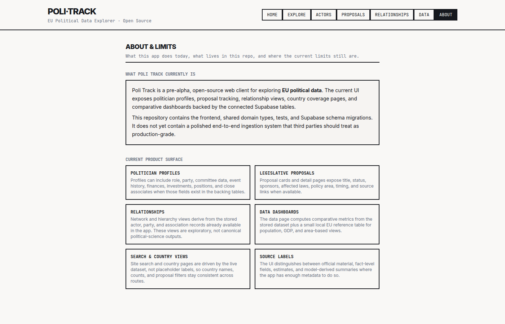

# About (`/about`)

Methodology page. Documents how Poli-Track classifies sources and events, and what it deliberately does not do.

## What you see

- Source hierarchy — which upstream sources carry which trust level.
- Evidence classification — `FACT`, `INFERENCE`, `FORECAST`, `UNKNOWN`.
- Correction policy — how revisions are recorded.
- What Poli-Track is not — e.g. a voting guide, a recommendation engine, a complete ingestion platform.

## Data sources used

None. This page is static copy.

## Code

- Route: `/about` → `src/pages/About.tsx`
