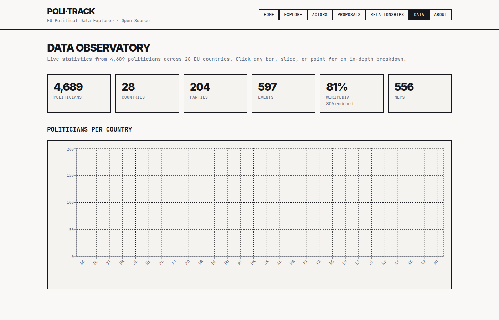

# Data

Comparative dashboards — the tallest page in the app.

## What it shows

The Data page is where Poli-Track turns its row counts into charts. It is the heaviest page by far (Recharts everywhere), intended as a "state of the project" board that also serves as a comparative dashboard for journalists.

You see, roughly in order:

- Proposals by country (bar chart).
- Proposals by status and policy area.
- Politicians by country and by party family.
- Per-capita and per-GDP-normalized ratios, where local EU reference constants are available.
- A coverage explorer with tabs for people, parties, and countries.

The comparative ratios rely on a small local EU reference table (population, GDP) that is hardcoded at the top of [Data.tsx](../src/pages/Data.tsx) — those values are not in the database today.

## Route

`/data`

## Data sources

- `politicians` — raw roster.
- `politicians` grouped — country stats.
- `proposals` — raw list for charts.
- `proposals` aggregates (JS) — groupings for status / policy area.
- Live Supabase coverage query — the ledger that backs the "coverage explorer" tabs.

## React components

- Page: [Data.tsx](../src/pages/Data.tsx)
- Hooks: [usePoliticians](../src/hooks/use-politicians.ts), [useCountryStats](../src/hooks/use-politicians.ts), [useProposals](../src/hooks/use-proposals.ts), [useProposalStats](../src/hooks/use-proposals.ts)
- Components: [DataCoverageExplorer.tsx](../src/components/DataCoverageExplorer.tsx)
- Coverage helpers: [data-coverage.ts](../src/lib/data-coverage.ts), [data-availability-heatmap.ts](../src/lib/data-availability-heatmap.ts)

## API equivalent

`GET /functions/v1/page/data` — coverage ledger, stats by country/status/area, demographics, aggregates. Cached 30 min. See [API reference](API-Reference).

## MCP tool equivalent

No single "data dashboard" tool. Agents can combine `search_politicians`, `search_proposals`, and `get_budget` to recreate the same views. See [MCP server](MCP-Server).

## Screenshots

## Known issues

- The EU reference constants are hardcoded. Per-capita and per-GDP ratios will drift from reality until a real geo/econ ingester (e.g. [Eurostat macro](Data-Source-Eurostat)) backfills them.
- "Politicians by party family" depends on `politician_positions.ideology_family`, which is only populated for politicians with a resolved position.
- Charts render from the full `politicians` / `proposals` arrays in memory; on slow devices the page can take ~2 s to settle after data load.
