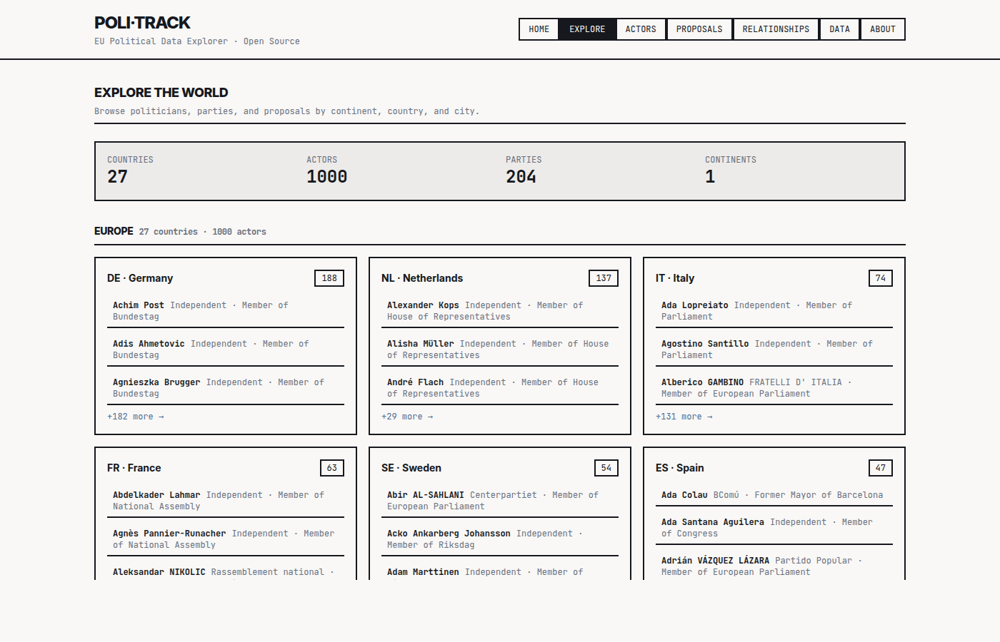

# Explore

Country-coverage overview.

## What it shows

Explore is the "map view" of Poli-Track. It tells you, at a glance, which EU countries have been ingested, how many politicians and parties are tracked in each one, and which continent they sit on. Picking a country here is the usual entry point into the [Country detail](Page-Country-Detail) page.

Rather than a chart, the page renders a dense brutalist grid of country cards (flag + name + counts) with a Europe-first continent grouping. Clicking a card routes to `/country/:id` with the lowercased ISO2 code.

## Route

`/explore`

## Data sources

- `politicians` grouped by `country_code`, `country_name`, `continent`, `party_name` — the core coverage roll-up.
- `politicians` raw list — used for party counting inside each country card.

## React components

- Page: [Explore.tsx](../src/pages/Explore.tsx)
- Hooks: [useCountryStats](../src/hooks/use-politicians.ts), [usePoliticians](../src/hooks/use-politicians.ts)

`useCountryStats` does its aggregation in JavaScript: it walks the politicians array once, counting distinct `party_name` values per country.

## API equivalent

`GET /functions/v1/page/explore` — returns per-continent country stats. See [API reference](API-Reference).

## MCP tool equivalent

No dedicated tool. Agents can call `search_politicians` filtered by `country` or `get_country` with an ISO2 code. See [MCP server](MCP-Server).

## Screenshots

## Known issues

- Countries with zero tracked politicians never show up, because the aggregator only sees rows that already exist in `politicians`.
- Party count is whatever distinct `party_name` strings are present — case-sensitive, language-sensitive, and unaware of party mergers. Two rows with slightly different spellings inflate the count.
- Continent grouping is derived from `politicians.continent`. If a row is missing a continent value, it falls into an "Unknown" bucket.
