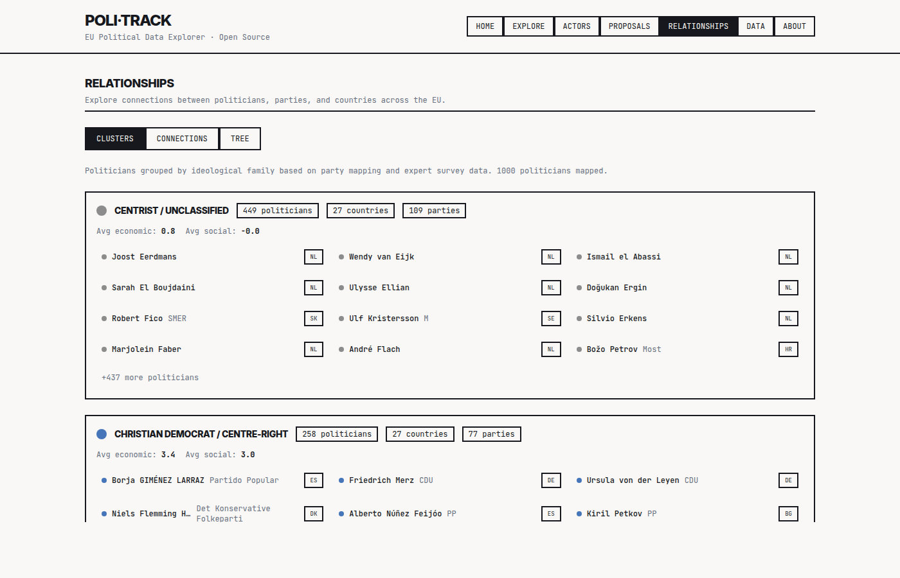

# Relationships (`/relationships`)

Graph and hierarchy views over politician-to-politician ties.

## What you see

- Selectable graph view: party alliances, committee colleagues, or full relationship network.
- Force-directed layout with each politician as a node. Edge weight comes from `politician_associations.strength`.
- Filters for country, party, and jurisdiction.
- Click a node to jump to that politician's [Actor Detail](Page-Actor-Detail) page.

## Data sources used

| Hook | Query |
|---|---|
| `usePoliticians()` | `politicians` |
| `useCountryStats()` | `politicians` (for country filters) |
| `useAllPositions()` | `politician_positions` joined to `politicians` |

Associations themselves are fetched per node via `usePoliticianAssociates(id)`.

The default seed data for associations comes from the `seed-associations` edge function, which infers ties from same-party and same-committee membership.

## Code

- Route: `/relationships` → `src/pages/Relationships.tsx`
